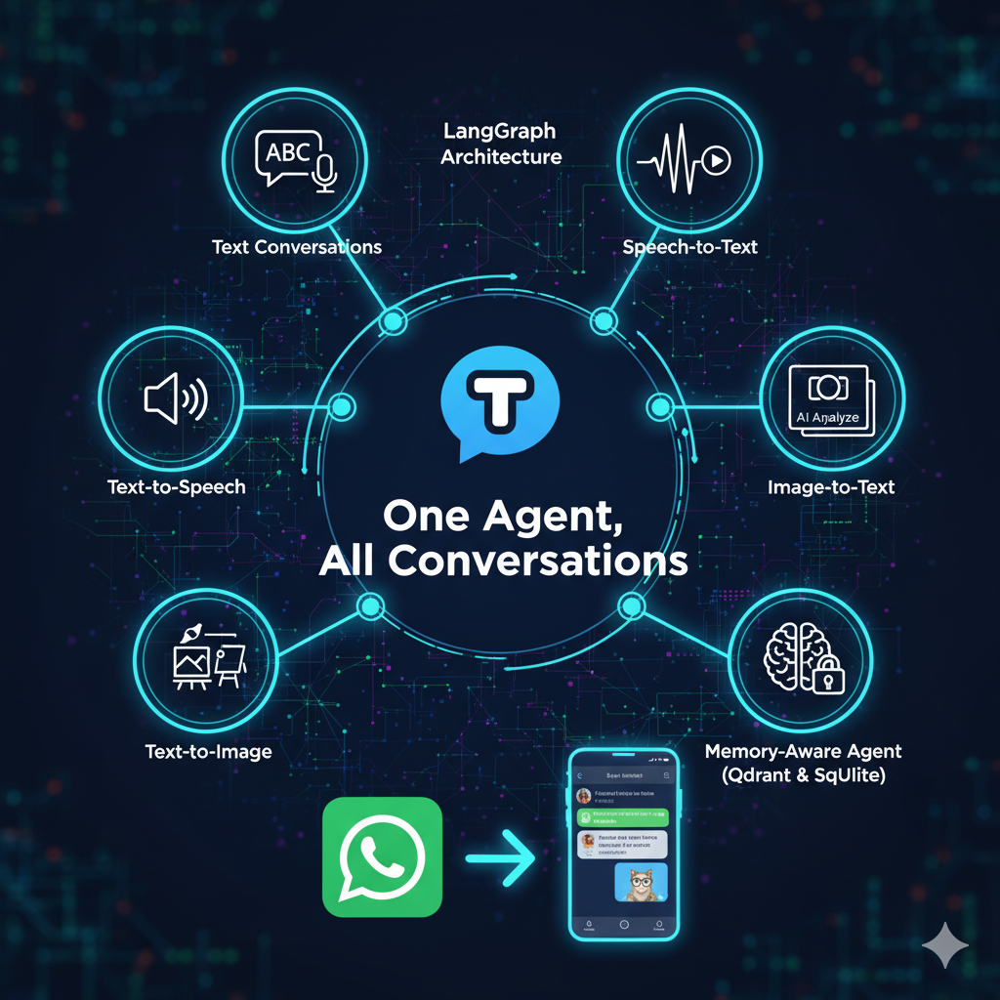
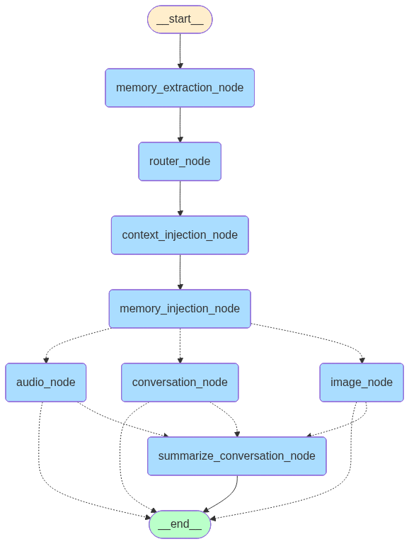

# Tovo – One Agent, All Conversations


Tovo is a **multimodal WhatsApp AI Agent** that processes **text, speech, and images** in one unified experience. It is designed to be **context-aware, memory-driven, and adaptive**, handling conversations just like a human would.

---

## 🎬 Demo

Watch a quick demonstration of Tovo's user interface and capabilities.

<a href="https://res.cloudinary.com/dnlldlioj/video/upload/v1759904946/demo%20videos/tovo_ui_yadsgh.mp4" title="Tovo UI Demo">
    
</a>

*(Click the image to play the video)*

---

## 🌟 Features

-   💬 **Text Conversations**: Engage in natural, human-like dialogue.
-   🎙️ **Speech-to-Text (STT)**: Understands and transcribes voice messages.
-   🔊 **Text-to-Speech (TTS)**: Responds with lifelike audio for a more personal touch.
-   🖼️ **Image-to-Text (ITT)**: Interprets and describes images sent by the user.
-   🖌️ **Text-to-Image (TTI)**: Generates creative images from textual prompts.
-   🧠 **Memory-Aware Agent**:
    -   **Long-Term Memory**: Utilizes a Qdrant vector store for semantic recall of important facts.
    -   **Short-Term Memory**: Employs SQLite to track recent conversational context for each session.
    -   **Conversation Summarization**: Condenses long conversations to maintain context efficiently.
-   🔄 **Adaptive Workflow**: Dynamically routes user input to the appropriate text, audio, or image generation workflow using LangGraph.

---

## 🛠️ Tech Stack

| Category            | Technology                                                              |
| ------------------- | ----------------------------------------------------------------------- |
| **Backend**         | FastAPI                                                                 |
| **Orchestration**   | LangChain, LangGraph                                                    |
| **Memory**          | Qdrant (Long-Term), SQLite (Short-Term)                                 |
| **Models**          | Groq (LLM, STT, ITT), ElevenLabs (TTS), Together AI (TTI)                |
| **Interface**       | WhatsApp Cloud API, Chainlit                                                   |

---

## 🏗️ Architecture

Tovo is built with a modular, graph-based architecture orchestrated by **LangGraph**.

-   **LangGraph**: Manages the agent's state, branching logic, and the overall flow of conversation.
-   **LangChain**: Powers the core reasoning, prompt management, and integration with various services.
-   **Memory System**: A dual-memory approach with **Qdrant** for long-term semantic storage and **SQLite** for short-term session memory ensures contextually rich interactions.
-   **Multimodal Modules**: Dedicated modules for Speech-to-Text, Text-to-Speech, Image-to-Text, and Text-to-Image handle the processing of different data types.
-   **WhatsApp API Interface**: Serves as the entry and exit point for all user communications, handling incoming messages and sending back responses in the correct format (text, audio, or image).

---

## 📊 Workflow Diagram

The diagram below illustrates the agent's decision-making and processing flow.



---

## 🚀 Getting Started

### 1. Clone the Repository

```bash
git clone https://github.com/bisVo159/Tovo.git
cd Tovo
```

### 2. Install Dependencies

```bash
pip install -r requirements.txt
```

### 3. Set Up Environment Variables

Create a `.env` file in the root directory and add the following keys:

```env
# WhatsApp Cloud API
WHATSAPP_TOKEN=your_whatsapp_token
WHATSAPP_PHONE_NUMBER_ID=your_phone_number_id
WHATSAPP_VERIFY_TOKEN=your_webhook_verify_token

# Service APIs
ELEVENLABS_API_KEY=your_elevenlabs_api_key
ELEVENLABS_VOICE_ID=your_voice_id
TOGETHER_API_KEY=your_together_api_key
GROQ_API_KEY=your_groq_api_key

# Qdrant Vector Database
QDRANT_URL=your_qdrant_cluster_url
QDRANT_API_KEY=your_qdrant_api_key
```

### 4. Run the Agent

Use Uvicorn to run the FastAPI application:

```bash
uvicorn src.interfaces.whatsapp.webhook_endpoint:app --reload
or
cd src/interfaces/chainlit
chainlit run app.py -w  
```

---

## 👨‍💻 Author

**Anik Biswas**  
📍 Kolkata, India  
🚀 Building backend, generative AI, and AIML applications.

